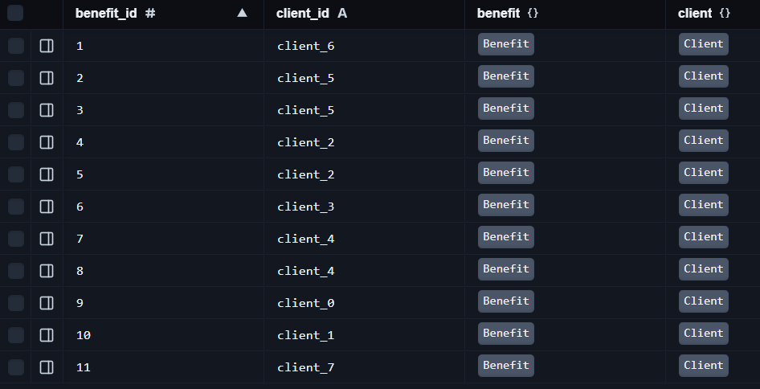
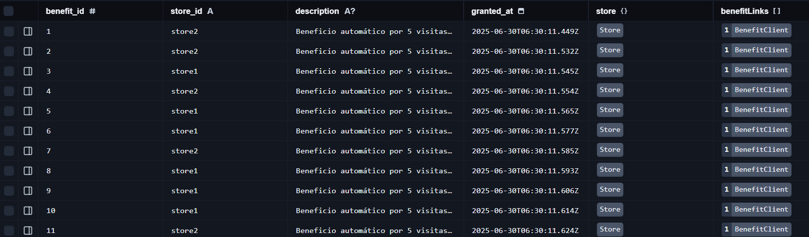
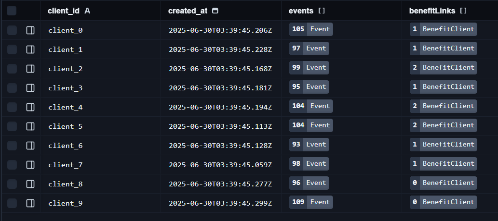
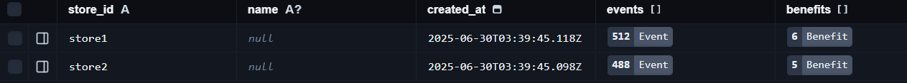
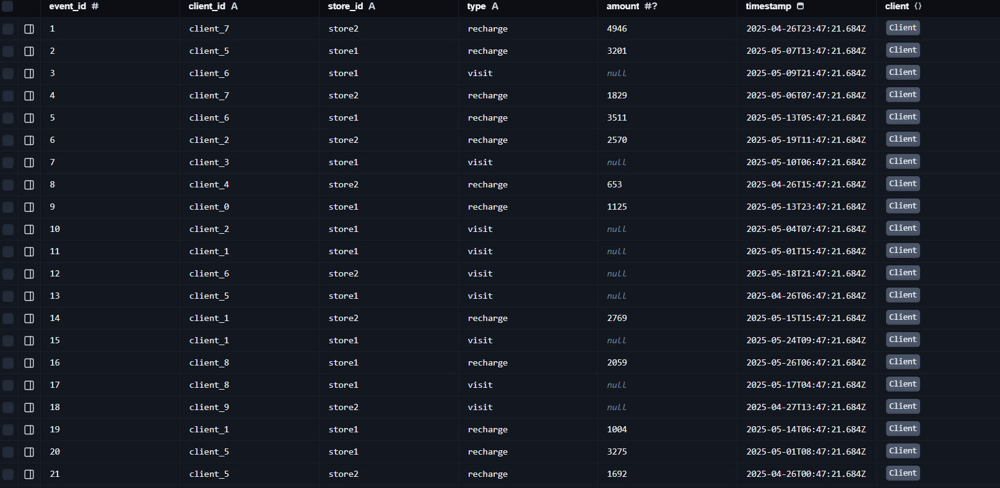

# Prueba Técnica Ruklo

## Propuesta de stack y arquitectura

Para abordar esta prueba técnica, he decidido utilizar un stack alineado con el entorno tecnológico de la empresa y que me permita escalar la solución fácilmente en un entorno real:

- **Frontend:** Next.js (aunque no es requerido para la prueba, lo considero para una posible extensión futura y alineación con el stack de la empresa).
- **Backend:** Nest.js (TypeScript), por su estructura modular, escalabilidad y soporte para buenas prácticas.
- **Base de datos:** PostgreSQL. Ideal para modelar relaciones y escalar.
- **ORM:** Prisma, por su integración con TypeScript y PostgreSQL, y facilidad de uso y migración.
- **Infraestructura:** AWS (pensando en escalabilidad futura, aunque para la prueba se ejecuta localmente).
- **Testing:** Jest (integrado en Nest.js).
- **Linting y formato:** ESLint + Prettier.

**Nota:** He optado por usar una base de datos, cargando los datos desde el archivo `ruklo_events_1000.json` para simular un entorno real y facilitar la escalabilidad y consultas eficientes. Esto permite que la solución sea más robusta y fácil de mantener a largo plazo

---

## 🧩 Resolución de la prueba

### 🧠 Parte 1

#### 1. Beneficio por visitas seguidas

**Pregunta:** Explica cómo harías para evitar errores si esto se ejecuta sobre muchos eventos (¿usarías un job, caché, base de datos?, ¿cómo lo validarías?)
**Respuesta:**

Actualmente, la lógica agrupa en memoria todos los eventos por cliente y recorre secuencialmente los eventos de cada cliente para detectar las 5 visitas consecutivas sin recarga. Este enfoque es eficiente para volúmenes pequeños o medianos.

Para escalar y evitar errores con grandes volúmenes de eventos, se recomienda:

- Procesar los eventos en lotes (batch) o mediante jobs asíncronos usando colas de tareas (por ejemplo, Bull/Redis) para no saturar la memoria y permitir reintentos controlados.
- O bien, delegar la lógica de detección a la base de datos usando una consulta SQL con funciones de ventana (window functions) para identificar las secuencias directamente en el motor, reduciendo la cantidad de datos transferidos y el uso de memoria en Node.js.

Ambas opciones pueden integrarse fácilmente a partir de la implementación actual, permitiendo mantener la lógica de negocio y mejorar la robustez ante grandes volúmenes de datos.

#### 2. Historial de transacciones agrupado

**Pregunta:** Considera cómo ordenarías y devolverías los datos.
**Respuesta:**
Para el historial de transacciones agrupado por semana, se entregan los datos en un json con la siguiente estructura:

```json
[
  {
    "client_id": "client_1",
    "history": [
      {
        "type": "visit",
        "weeks": [
          { "week": "2025-W25", "count": 3 },
          { "week": "2025-W26", "count": 5 }
        ]
      },
      {
        "type": "recharge",
        "weeks": [
          { "week": "2025-W25", "average_amount": 0 },
          { "week": "2025-W26", "average_amount": 1200 }
        ]
      }
    ]
  }
]
```

**Nota:** Actualmente, el endpoint, no entrega semanas con `average_amount` dado que desde los datos, no hay ninguna semana sin recargas, para cada cliente, pero se ha implementado la lógica para que si existieran semanas sin recargas, se devuelvan con `average_amount` como 0.

---

### ✍️ Parte 2

#### Limitaciones de la solución actual

- **Beneficio automático por 5 visitas seguidas:**
  - La lógica actual procesa todos los eventos en memoria y recorre secuencialmente los eventos de cada cliente y tienda. Esto es eficiente para volúmenes pequeños o medianos, pero puede consumir mucha memoria y tiempo si la cantidad de eventos crece mucho.
  - No se implementa procesamiento incremental ni en tiempo real: si los eventos llegan en streaming o en lotes muy grandes, habría que adaptar la lógica para evitar reprocesar todo el histórico cada vez.
  - La deduplicación de beneficios depende de la consulta previa a la base de datos, lo que puede ser costoso si hay muchos clientes y beneficios.

- **Historial de transacciones agrupado:**
  - El cálculo del historial semanal se hace en memoria, agrupando todos los eventos del cliente y generando el rango de semanas. Si el rango es muy grande y hay muchos clientes, el consumo de memoria puede crecer rápidamente.
  - Actualmente, la lógica depende de que los eventos estén correctamente fechados y no contempla eventos fuera de rango o inconsistentes.
  - Si el volumen de datos es muy alto, la consulta inicial (`findMany`) puede ser lenta y costosa.

#### Escalabilidad con 100.000 eventos diarios

- **Beneficio automático por 5 visitas seguidas:**
  - Procesar 100.000 eventos diarios en memoria no es escalable. Se recomienda migrar la lógica a un job batch asíncrono, dividir el procesamiento por cliente o tienda, y/o delegar la detección de secuencias a la base de datos usando SQL avanzado (window functions).
  - Para escenarios de alta concurrencia, sería ideal usar colas de procesamiento y particionar los datos para evitar cuellos de botella.

- **Historial de transacciones agrupado:**
  - Con 100.000 eventos diarios, la consulta y el procesamiento en memoria pueden volverse lentos y consumir demasiados recursos.
  - Para escalar, se recomienda paginar los resultados, limitar el rango de fechas consultado, o precalcular/agregar los datos semanalmente en la base de datos (por ejemplo, usando vistas materializadas o tablas de agregados).
  - También se puede considerar exponer endpoints que permitan filtrar por cliente y rango de fechas para reducir la cantidad de datos procesados en cada consulta.

---

## ✅ Requisitos técnicos

## 📚 Decisiones y notas técnicas

### Modelo de datos

He optado por un modelo relacional simple y eficiente para la prueba:

- **clients y stores**: Identifican a los actores principales.
- **events**: Almacena cada acción (visita o recarga) con su tipo, monto y timestamp, permitiendo consultas eficientes para ambos requerimientos.
- **benefits**: Registra los beneficios otorgados, vinculados a cliente y tienda, con descripción y fecha.

Las relaciones permiten consultar fácilmente el historial de eventos y los beneficios por cliente y tienda.
Este modelo es flexible, escalable y fácil de consultar para los dos objetivos principales de la prueba. Además, permite futuras extensiones (más tipos de eventos, más atributos en beneficios, etc.)

El E/R en DBML:

```SQL
Project ruklo {
  database_type: 'PostgreSQL'
  Note: 'Modelo de datos para la aplicación de fidelización Ruklo'
}

// Tabla de Clientes
Table client {
  client_id   varchar   [pk, not null]
  created_at  timestamptz [not null, default: `now()`]
}

// Tabla de Tiendas
Table store {
  store_id    varchar   [pk, not null]
  name        varchar
  created_at  timestamptz [not null, default: `now()`]
}

// Tabla de Eventos (visitas y recargas)
Table event {
  event_id    serial     [not null, increment]
  client_id   varchar    [not null]
  store_id    varchar    [not null]
  type        varchar(10) [not null] // 'visit' o 'recharge'
  amount      int        // solo para 'recharge'
  timestamp   timestamptz [not null]
  primary     key(client_id, store_id) [pk]
}

// Tabla de Beneficios otorgados
Table benefit {
  benefit_id  serial     [pk, not null, increment]
  client_id   varchar    [not null]
  store_id    varchar    [not null]
  description varchar
  granted_at  timestamptz [not null, default: `now()`]
}

// Tabla de relación entre Beneficios y Clientes
// Permite que un beneficio pueda ser otorgado a varios clientes
Table benefit_client {
  benefit_id  serial     [not null]
  client_id   varchar    [not null]
  primary     key(client_id, benefit_id) [pk]
}


// Relaciones
Ref: event.client_id > client.client_id // muchos eventos pertenecen a un cliente
Ref: event.store_id > store.store_id // muchos eventos pertenecen a una tienda
Ref: benefit.client_id <> client.client_id // muchos beneficios pertenecen a un cliente
Ref: benefit.store_id > store.store_id // muchos beneficios pertenecen a una tienda
Ref: benefit_client.benefit_id > benefit.benefit_id
Ref: benefit_client.client_id > client.client_id
```

Este E/R tiene una version visualizable en los docs del proyecto:
[Ver modelo E/R (PDF)](./docs/ER-Ruklo-prueba-tecnica.pdf)

### Implementación docker-compose para desarrollo

He creado un `docker-compose.yml` para facilitar el desarrollo y pruebas locales para la base de datos
**PostgreSQL**: Base de datos para almacenar los eventos y beneficios.
Esta dockerización permite levantar un entorno de desarrollo completo con un solo comando, facilitando la colaboración y pruebas locales.

```bash
docker-compose up -d
```

Tome esta decisión para asegurar que el entorno de desarrollo sea consistente y fácil de configurar, permitiendo a cualquier desarrollador clonar el repositorio y comenzar a trabajar sin complicaciones adicionales.

Luego, es necesario ejecutar las migraciones de Prisma para crear las tablas en la base de datos:

```bash
npx prisma migrate dev
```

### Carga de datos inicial desde el .json a la base de datos

He implementado un script en el backend que carga los datos iniciales desde el archivo `ruklo_events_1000.json` a la base de datos PostgreSQL. Este script se ejecuta al iniciar la aplicación, asegurando que los datos de prueba estén disponibles para las consultas y pruebas.

**Nota:** Para que el script funcione es necesario ejectuar:

```bash
npx prisma generate
```

Lo que permite generar los clientes de Prisma y así poder ejecutar el script de carga de datos, con el comando:

```bash
npx ts-node import-events.ts
```

#### Cantidad inicial de entidades

- **Clientes:** 10 (de client_0 a client_9)
- **Tiendas:** 2 (de store_1 a store_2)
- **Eventos:** 1000 (visitas y recargas)

### Módulos de la aplicación

La aplicación está estructurada en módulos siguiendo las entidades y casos de uso principales:

- **ClientsModule:** Gestiona la información de los clientes y expone endpoints para consultar su historial de eventos y transacciones agrupadas.
- **BenefitsModule:** Encapsula la lógica de detección y otorgamiento de beneficios automáticos, así como la consulta de beneficios por cliente o tienda.
- **StoresModule:** Permite consultar información de tiendas y sus relaciones con clientes y beneficios (opcional, pero recomendado para escalabilidad).
- **EventsModule:** Centraliza la carga, consulta y procesamiento de eventos de visitas y recargas (opcional, útil para claridad y futuras extensiones).

Esta modularización permite mantener el código organizado, escalable y alineado con las mejores prácticas de NestJS.

### Endpoints implementados

- **GET /benefits/automatic**
  - Detecta y otorga beneficios automáticos por visitas 5 consecutivas sin recarga.
  - Retorna la cantidad de beneficios creados.

Tabla BenefitClient en Prisma studio:



Tabla Benefit en Prisma studio:



Tabla Client en Prisma studio:



Tabla Store en Prisma studio:



Tabla Event en Prisma studio:



**Nota:** Son 1000 eventos de prueba cargados desde el archivo `ruklo_events_1000.json`, que incluyen visitas y recargas,
por lo tanto en la foto no se ven todos los eventos.

**Supuesto:** Se asume un cliente no puede tener el mismo beneficio (con el mismo `benefit_id` y `store_id`) más de una vez. Si se detecta un beneficio ya otorgado, no se crea uno nuevo. Pero si el beneficio es diferente (por ejemplo, si se cambia la tienda o la descripción), se crea un nuevo registro. Por lo tanto, un cliente puede tener múltiples beneficios diferentes a lo largo del tiempo.

- **GET /clients/transaction-history**
  - Retorna el historial de transacciones de los clientes, agrupado por semana.
  - Incluye visitas y recargas, con totales y conteos por semana.
  
[Ver json resultante del endpoint (JSON)](./docs/history-response.json)
